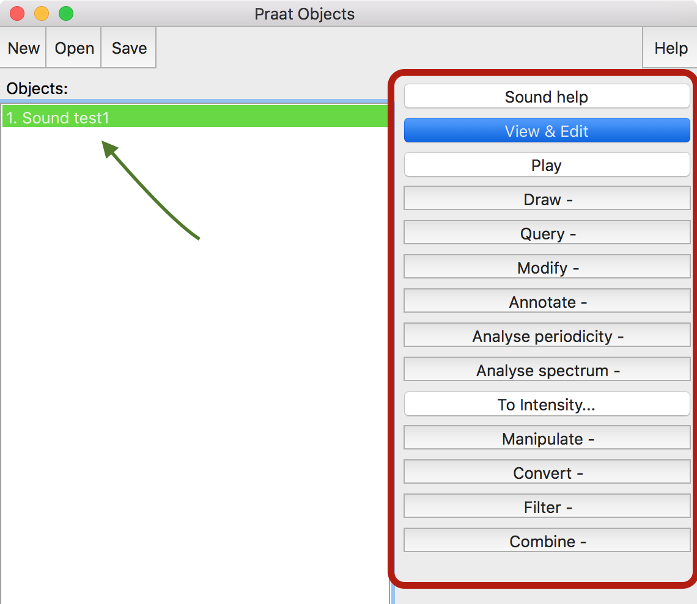
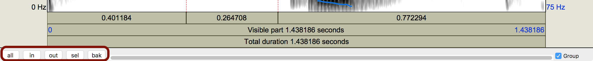
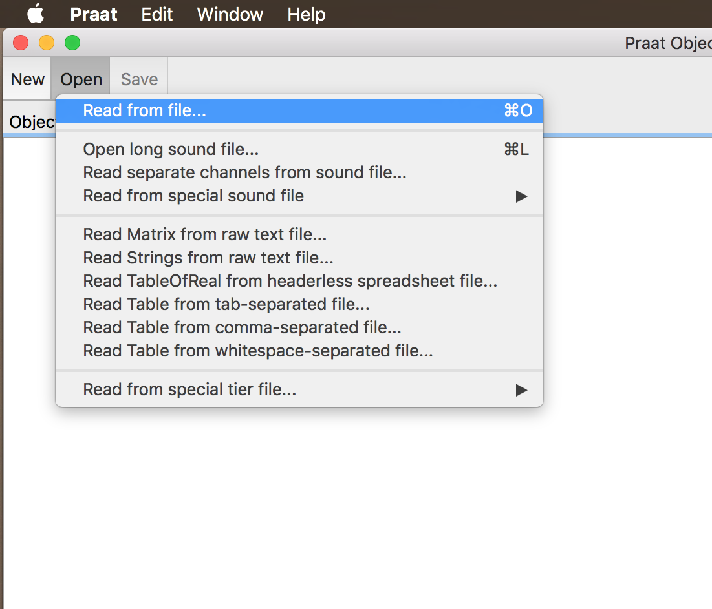

## About Praat

<div align="center">
  
</div>

<p></p>

- Praat is a free, cross-platform program used in linguistics for
  - speech analysis, synthesis, and manipulation
  - labeling and segmentation
  - listening experiments
  - statistics
- Download [here](http://www.praat.org)

---

## Overview

<div style="float:right">
  
</div>

### In this tutorial you will learn about:

- the Praat interface
- objects
- spectrograms/waveforms

</br>

### You will also learn how to:

- record sound objects
- view and reproduce sound objects
- import sound files
- save sound files

--- .segue bg:grey

# The Praat interface

---

## The Praat interface

### Upon opening Praat, you should see two windows:

<div align="center">
  
</div>

<p></p>

1. **Praat Objects**: (left) the window where objects are stored, accessed, and manipulated
2. **Praat Picture**: (right) the window where graphing outputs are displayed

<p></p>

>- We will mainly work in **Praat Objects** (you can close **Praat Picture** if you want)
>- Notice there is not a lot going on without any objects

---

## Record a sound object

<div style="float:right">
  
  
</div>

### In order to record a sound object you must have an internal microphone or 
you must connect a microphone to your computer

- To record a sound object:
  - Go to the Praat Object window
  - Click ```New``` > ```Record mono Sound```
- A **SoundRecorder** window will appear

---

## SoundRecorder

<div align="center">
  
</div>

---

## SoundRecorder

<div style="float:right">
  
  
</div>

### From this window you can:

- Choose...
  - Channels (```mono```/stereo)
  - Input source (```Built-in Microphone```)
  - Sampling frequency (```44100 Hz```)
- Record, Stop, and Play speech
- Name the object (default is 'Untitled')

---

## SoundRecorder

<div style="float:right">
  
  
</div>

### Record a sound object

1. Use ```Record``` and ```Stop``` to record some speech
2. Use ```Play``` to listen to your recording
3. Repeat until you are satisfied
4. Give your recording a name (ex. 'test1') and then choose ```Save to list & Close``` 

</br>

- The recording will appear in the **Object window**

--- .segue bg:grey

# Objects

--- 

## Sound objects

<div style="float:right">
  
  
</div>

- You have created a ```Sound object```, which now appears in the **Praat Objects** 
window, under the heading ```Objects``` 
- Notice that Praat gives the object a number and tells you what kind of object it is:  
```1. Sound test1```
- Also notice that there is now a long menu of options on the right
- Praat has many types of objects, each of which have different options in their 
respective menus (these are the options that correspond  
with sound objects)

<p></p>

>- Click ```View & Edit``` to create a spectrogram of the Sound object

--- .segue bg:grey

# Spectrograms and waveforms

---

## Spectrograms and waveforms

<div style="float:right">
  
  
</div>

- You should see something similar to the image on the right
- The figure is divided into two parts:
  1. **waveform**/**oscillogram** (top):  
  two dimension display of sound pressure over time
  2. **spectrogram** (bottom):  
  three dimension display of amplitude (vertical axis)
  and frequency (darkness) over time. 
- You can reproduce the recording by pressing the  
```tab``` key, and stop the recording by pressing ```tab``` again.
- You can use either the waveform or the spectrogram  
to select portions of the recording 
- Select a portion and listen to it

---

## Spectrograms and waveforms

<p></p>

<div align="center">
  
</div>

### View options

- ```in```: zoom in
- ```out```: zoom out
- ```sel```: zoom in on a selected area (must select area first)
- ```bak```: return to previous view
- ```all```: zoom all the way out (show entire duration of sound object)

--- .segue bg:grey

# Saving and importing sound files

---

## Save a sound object

<div style="float:right">
  
  
</div>

- Saving a sound object to your computer is easy
- In the **Praat Objects** window, highlight the object you would like to save
- Click the ```Save``` tab
- Select the format you would like (we will typically use .WAV files)
- Another window will pop-up in which you can name the file, as well as specify 
the directory to which it will be saved

</br>

- If you already have sound files to work with...

---

## Importing sound files

<div style="float:right">
  
  
</div>

- Importing a sound file from your computer is equally easy
- In the **Praat Objects** window click the ```Open``` tab
- Select ```Read from file...```
- Another window will pop-up in which you can find your sound file 
and select ```Open```
- The file will then appear as a sound object in the ```Objects``` 
section of the **Praat Objects** window

<p></p>
<BLUE>Practice</BLUE>

- Download the following sound file to your computer, open it 
in Praat and create a spectrogram 
([paper.wav](http://www.jvcasillas.com/praat/libraries/assets/wavs/paper.wav))

--- 

## Conclusion

<div style="float:right">
  
  
</div>

### In this short tutorial you learned about:

- the Praat interface
- objects
- spectrograms/waveforms

### and now you are able to:

- record sound objects
- view and reproduce sound objects
- import sound files
- save sound files

### Additional help

- Try another [praat tutorial](http://www.jvcasillas.com/praat/)
- Email me (joseph.casillas@rutgers.edu)

---

## References

- ref
