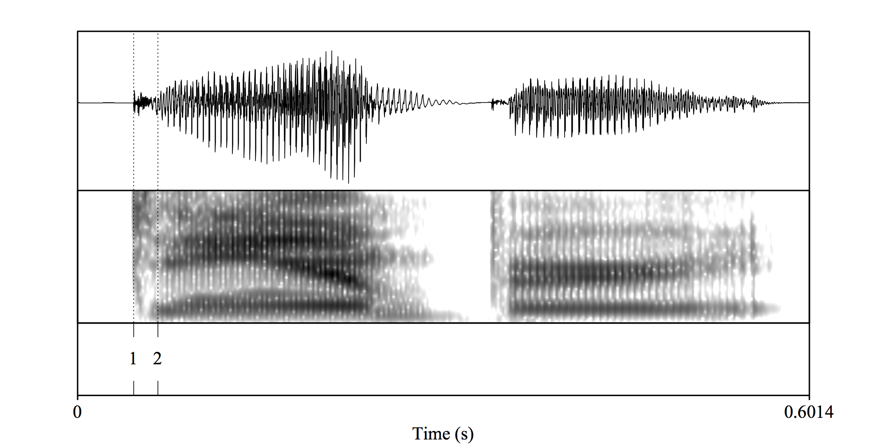
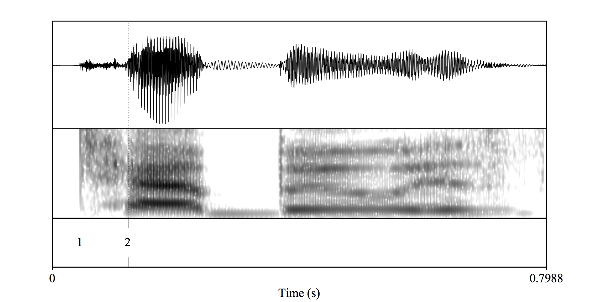
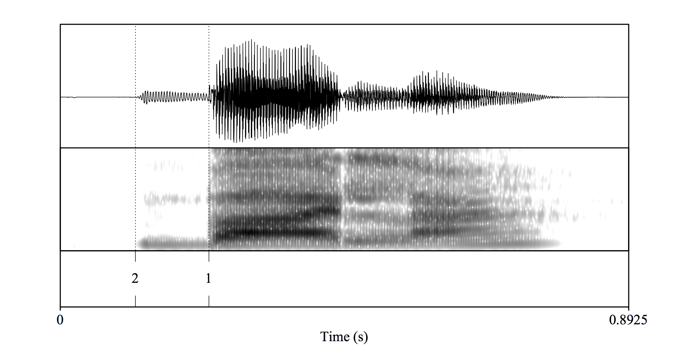
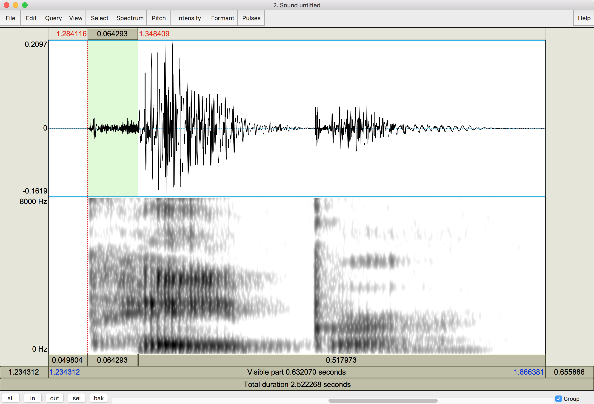

## About Praat

<div align="center">
  
</div>

<p></p>

- Praat is a free, cross-platform program used in linguistics for
  - speech analysis, synthesis, and manipulation
  - labeling and segmentation
  - listening experiments
  - statistics
- Download [here](http://www.praat.org)

---

## Overview

<div style="float:right">
  
  
</div>

### In this tutorial you will learn about:

- Voice Onset Time (VOT)

</br>

### You will learn how to:

- Measure VOT in word initial stops
- Create graphics with waveforms/spectrograms and time segmentations

--- .segue bg:grey

# Voice onset time

---

## Voice onset time

<div style="float:right">
  
  
</div>

- Measurement (in ms) associated with stop consonants
- One of several acoustic correlates of voicing contrasts (i.e. 'bin' vs. 'pin')
- Result of coordination of gestures
- <BLUE>Time interval (in ms) between the release of the stop burst and the onset of voicing</BLUE>

---

## Types of VOT

<div style="float:right">
  
  
</div>

### Three phonetic realizations of voicing

- **Lead** (negative) VOT: voicing begins before release of stop (approx. -60ms)
- **Short-lag** (positive) VOT: short time interval after release of stop before onset of voicing (0ms to 30ms)
- **Long-lag** (positive) VOT: longer time interval after release of stop before onset of voicing (approx. 60ms) 

### Cross-linguistic differences

- What constitutes a phonologically voiced or voiceless stop is language-specific
- Average VOT values vary depending on language, speaker, phonetic context, etc.
- That said, they typically fall in a variety-specific range

---

<div align="center">
  
</div>

---

## Cross-linguistic differences

### English VOT

- English has a two-way voicing contrast 
	- Phonologically voiced stops realized with **short-lag** VOT
	- Phonologically voiceless stops realized with <BLUE>long-lag</BLUE> VOT

### Spanish VOT

- Spanish has a two-way voicing contrast
	- Phonologically voiced stops realized with **lead** VOT
	- Phonologically voiceless stop realized with <BLUE>short-lag</BLUE> VOT

---

## Spanish vs. English

</br>

<div align="center">
  
</div>

--- .segue bg:grey

# Measuring VOT

---

## Measuring VOT

- VOT: <BLUE>Time interval (in ms) between the release of the stop burst and the onset of voicing</BLUE>
- In the spectrogram/waveform we need to locate 2 landmarks:
	- (1) stop release 
	- (2) voicing onset 
- ```Time in ms between (1) and (2) = VOT```

---

## Measuring VOT

### English voiced stop (/d/ 'damper')

<div align="center">
  
</div>

- (1) stop release 
- (2) voicing onset 
- ```Time in ms between (1) and (2) = VOT```

---

## Measuring VOT

### English voiceless stop (/t/ 'taboo')

<div align="center">
  
</div>

- (1) stop release 
- (2) voicing onset 
- ```Time in ms between (1) and (2) = VOT```

---

## Measuring VOT

### Spanish voiced stop (/b/ 'bala')

<div align="center">
  
</div>

- (1) stop release 
- (2) voicing onset 
- ```Time in ms between (1) and (2) = VOT```

---

## Measuring VOT

### Spanish voiceless stop (/p/ 'pala')

<div align="center">
  
</div>

- (1) stop release 
- (2) voicing onset 
- ```Time in ms between (1) and (2) = VOT```

---

<div align="center">
  
</div>

<p></p>

- When you select the voicing onset and the stop release, Praat will automatically give you the 
time interval
- The VOT is 64ms for this particular English /p/ (long-lag VOT)

---

## Practice

### English

- Create recordings of the words 'bin' and 'pin' in English
- Examine the waveforms and spectrograms
- Measure their VOT

### Spanish

- Download the following files
	- [bata](http://www.jvcasillas.com/praat/libraries/assets/wavs/bata.wav) 
	
	<audio controls>
      <source src="../../libraries/assets/wavs/bata.ogg" type="audio/ogg">
      <source src="../../libraries/assets/wavs/bata.wav" type="audio/mpeg">
      Your browser does not support the audio element.
    </audio>
	- [pata](http://www.jvcasillas.com/praat/libraries/assets/wavs/pata.wav) 
	
	<audio controls>
	  <source src="../../libraries/assets/wavs/pata.ogg" type="audio/ogg">
	  <source src="../../libraries/assets/wavs/pata.wav" type="audio/mpeg">
	Your browser does not support the audio element.
	</audio>
- Import them into Praat
- Examine the waveforms and spectrograms
- Measure their VOT

--- .segue bg:grey

# Creating graphics

---

## Creating graphics

<div style="float:right">
  
  
</div>

- **No screenshots**
- Praat has exceptional graphing capabilities

---

## Step by step approach to plotting VOT in Praat

<BLUE>1</BLUE>. Select sound object you want to graph  
<BLUE>2</BLUE>. Click ```View and Edit```

---

## Step by step approach to plotting VOT in Praat

<BLUE>3</BLUE>. Select desired region of recording > zoom in (```sel```)

---

## Step by step approach to plotting VOT in Praat

<BLUE>4</BLUE>. Select VOT range (stop release to onset of voicing)

---

## Step by step approach to plotting VOT in Praat

<BLUE>5</BLUE>. Draw waveform  

- ```File``` > ```Draw visible sound...```
- Unselect ```Draw selection times``` and ```Garnish```
- Click Ok

**Note**: You may have to erase (Edit > Erase all) and reselect the viewport. 
Try to get yours to look like this and redo step 5 as necessary

---

## Step by step approach to plotting VOT in Praat

<BLUE>6</BLUE>. Once you have a satisfactory waveform, without changing the viewport, select 
the tab ```Margins``` > ```Draw inner box```

---

## Step by step approach to plotting VOT in Praat

<BLUE>7</BLUE>. Next select a new rectangle in the viewport, just below the waveform

- Try to match yours to the rectangle in the image (use the rulers)

---

## Step by step approach to plotting VOT in Praat

<BLUE>8<BLUE>. Draw the spectrogram

- Go back to the spectrogram window
- Select the tab ```Spectrum``` > ```Paint visible spectrogram...```
- Unselect ```Erase first``` and ```Draw selection times```
- Select ```Garnish```
- Click Ok

---

## Step by step approach to plotting VOT in Praat

<BLUE>9</BLUE>. Select the waveform and the spectrogram in the viewport  
<BLUE>10</BLUE>. Save as .pdf/.png

---

## Step by step approach to plotting VOT in Praat

1. Select sound object you want to graph  
2. Click ```View and Edit```
3. Select desired region of recording > zoom in (```sel```)
4. Select VOT range (stop release to onset of voicing)
5. Draw waveform  
	- ```File``` > ```Draw visible sound...```
6. Once you have a satisfactory waveform, without changing the viewport, select 
the tab ```Margins``` > ```Draw inner box```
7. Next select a new rectangle in the viewport, just below the waveform
8. Draw the spectrogram
	- Select the tab ```Spectrum``` > ```Paint visible spectrogram...```
9. Select the waveform and the spectrogram in the viewport  
10. Save as .pdf/.png

---

## Conclusion

<div style="float:right">
  
  
</div>

### In this short tutorial you learned about:

- Voice Onset Time (VOT)

### and now you are able to:

- Measure VOT in word initial stops
- Create graphics with waveforms/spectrograms and time segmentations

### Additional help

- Try another [praat tutorial](http://www.jvcasillas.com/praat/)
- Email me (joseph.casillas@rutgers.edu)

---

## References

- ref
